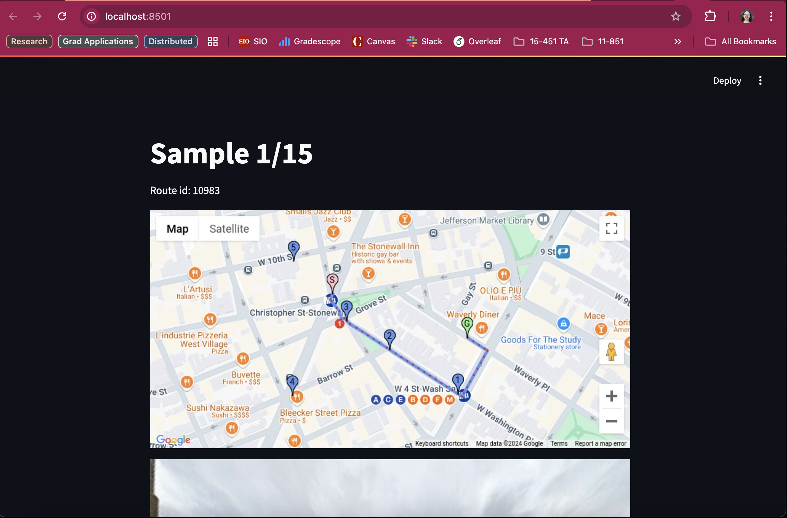
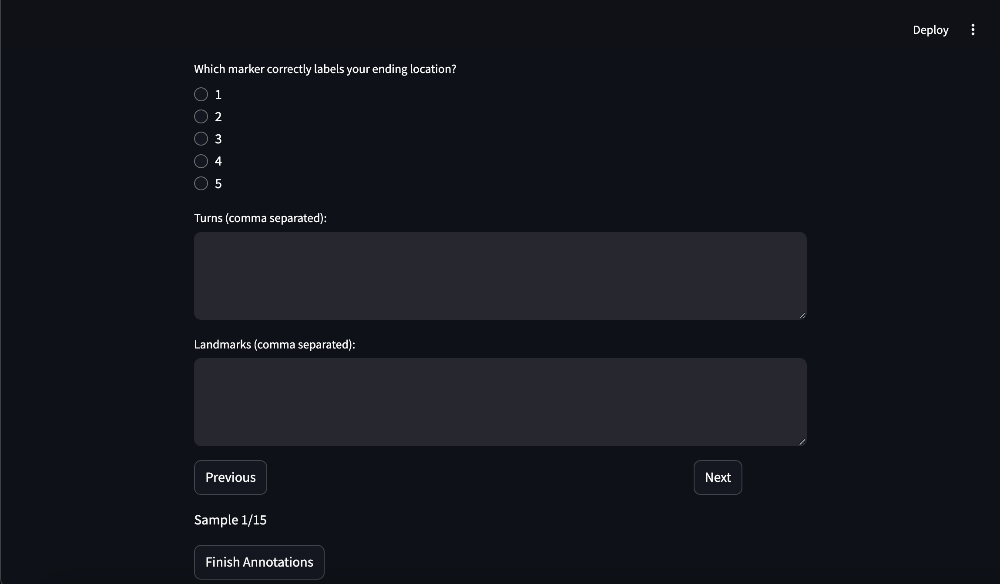

# Instructions for Annotators

## Setup

To participate in this study, you'll need to prepare your environment by following the instructions below:

1. **Install Python**: Ensure you have Python installed on your system (version 3.7 or higher is recommended).
2. **Set Up the Environment**:
    - All required packages are listed in the `requirements.txt` file. 
   - **Option 1 (Must have the same computer as me)**: Use the included Python virtual environment:
     - Activate it by running:  
       ```bash
       source mapdata/bin/activate
       ```
   - **Option 2**: Create a new virtual environment using the provided `setup.sh` script:
     - Run the script:  
       ```bash
       chmod +x setup.sh
       ./setup.sh
       ```
   - **Option 3**: Use your preferred method to set up an environment (e.g., creating a Conda environment). Make sure to install the packages listed in `requirements.txt`. You can install these by using `pip install -r requirements.txt`.

---

## Task Description

You will take on the role of an agent navigating a marked path on a map. Your objective is to determine your location along this path based on a series of visual cues.

### Example map


### Step-by-Step Task Instructions:

1. **View the Images**:
   - You will be presented with a map that has start (S) and goal (G) markers, a marked path from S to G, as well as markers 1 through 5.
   - You will also be presented with a series of street-view images that represent your journey along the marked path on the map.
   - The images progress sequentially from the starting point toward an intermediate point along the route.
   - At intervals, the map will reappear to assist in your localization (so you don't need to scroll back up to see the map).

2. **Analyze Your Location**:
   - When you reach the final image in the series, analyze the sequence of images and the map to determine your current location along the route.

3. **Identify Your Location**:
   - Examine the images to infer:
     - **Turns**: What turns (e.g., left, right) have been made along the path, if any?
     - **Landmarks**: What landmarks have been passed during the journey, if any?
     - **Current Marker**: Select the marker (1, 2, 3, 4, or 5) on the map that you believe to mark your current location.

4. **Provide Your Response**:
   - Fill in the appropriate text boxes in the interface with the following information:
     - **Turns**: List the turns you've made, separated by commas. If no turns have been made, leave the box empty.
       - Example: `right, left, right`
     - **Landmarks**: List any landmarks you’ve passed, separated by commas. If no landmarks have been passed, leave the box empty.
       - Example: `Schenley Park, Mercurio's Pizza, Carnegie Mellon University`
     - **Marker**: Select the marker closest to your current location using the multiple-choice selector.

---

### Example Response Format
- **Turns**: `right, left, right`  
- **Landmarks**: `Highland Park, Mercurio's Pizza, Carnegie Mellon University`  
- **Marker**: `3`


---

## Starting the Study

| Participant | Range  |
|-------------|--------|
| Qunhua Li | (0, 15)  |
| Song Jin | (15, 30) |
| Participant 3 | (30, 45) |
| Participant 4 | (45, 60) |


1. Navigate to the folder containing the study files.
2. Open `interface.py` and change line 7 (`SAMPLE_RANGE = list(range(0, 15))`) to reflect your assigned range from the above table.
3. Start the interface by running the following command:
   ```bash
   streamlit run interface.py
   ```
4. Work on the samples. You can navigate between samples with the buttons at the bottom of the page and edit previous answers.
> **Note:** After typing in any text boxes, be sure to click out of the text box before clicking on "Previous", "Next", or "Finish annotations".
5. Once you are happy with your submission, click "Finish annotations" and briefly review `annotations.csv` to ensure that your answers were saved correctly.
6. Return your CSV file to claireji@andrew.cmu.edu.

Thank you for participating in this study! If you have any questions or encounter any issues, please contact claireji@andrew.cmu.edu.


